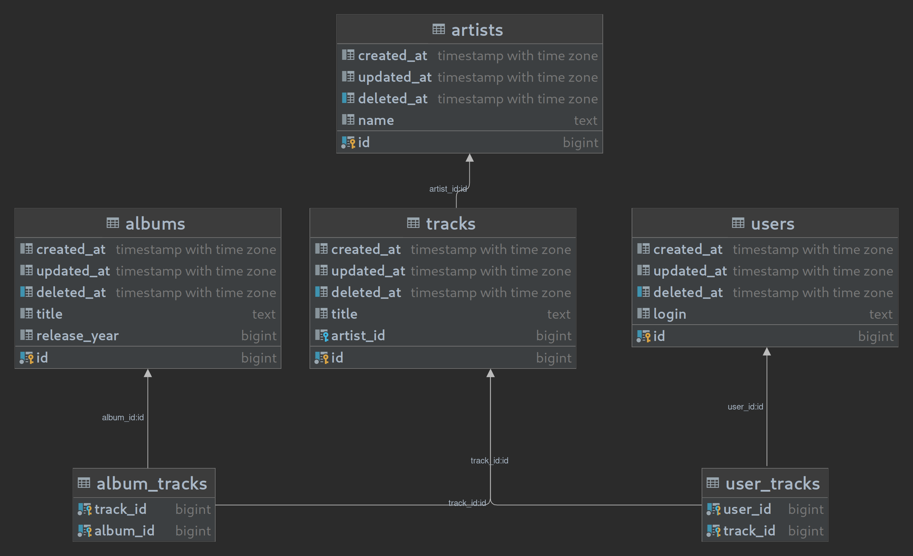

# all-sounds
Hi Deezer people, I'm Florent! This a proposition of a Go implementation for the REST API exercise.

<!-- ----------------------------------------------------------------------------------------------- -->

## Requirements

A few tools can be useful to build, run, and test this application: 
- [go 1.19](https://go.dev/doc/install) to buil the sources;
- [docker](https://docs.docker.com/get-started/) and [docker-compose](https://docs.docker.com/compose/) to run the stack in containers;
- [curl](https://curl.se/docs/manpage.html) to consume / test our API endpoints;
- [jq](https://stedolan.github.io/jq/) to get nicely formatted json responses.

## Toolchain

### RDBMS

The relational DB system chosen for this solution is postgresql, run as a docker container.

### Libraries

In order not to re-invent the wheel, a little help from the great golang open-source community is always useful. Here's the dependencies I used to implement this API (unexhaustive):

- [gin-gonic](https://gin-gonic.com/docs/) - A powerful http web framework to easily write and maintain REST endpoints;
- [gorm](https://gorm.io/) - The best solution I found to interact with a postgresql instance and generate the relational schema used in this solution;
- [dockertest](https://github.com/ory/dockertest) - Because end-to-end integration is far better than mocking to validate interactions with the RDBMS. Dockertest is used to run a postgresql container for each test suite;
- [viper](github.com/spf13/viper) - Viper is used to inject per-environment configuration;
- [faker](https://github.com/bxcodec/faker) - Integrations tests require data provisioning, faker fits perfectly for this purpose.

## Omitted components and implementations

Due to understandable tme constraint, some server components and software implementations have been voluntarily omitted from this solution. Let's present how this application could be properly industrialized and released.

**Rate limiting** should be implemented on the router layer, despite the fact that gin doesn't provide such feature natively, but I might be wrong on this one.

**Logging / Observability** has to be improved on all levels. Here we're just redirecting runtime informations on the console output. A proper way to do it would be either using elastic search alongside with Kibana or Grafana's Loki and Fluentd.

**Swagger** annotations should be added to the code in order to auto generate the API documentation. Don't worry, we'll document the endpoints further away.

## Relation schema

Here's the relational schema used to store the API data, entirely defined with Gorm entities as declared in the [model](https://gorm.io/docs/migration.html#Auto-Migration) package and persisted on server startup with [auto migrate](https://gorm.io/docs/migration.html#Auto-Migration) feature.



## Run it!

### With docker compose

The compose file contained in this features two services:
- **db**: the postgresql db container;
- **server**: the Go API server container, based on the root Dockerfile of this project.

To get the stack up and running, simply run:
`➜  ~ docker-compose up`

### As a standalone application

If you wish to start the application server in Go native mode, simply:
`➜  ~ ENV=dev go run ./cmd/server`

Note that the `ENV` must be set to load a specific config file to interact with the database outside the docker created subnet. Obviously, a postgresql instance must be running in order to get a functional API server.

## Test it!

We mentioned earlier that some implementations have been omitted, still this application server is fully functional and ready to serve our API endpoints. Here's how to use them!

### Artist

`all-sounds` provides a few generic endpoints to read the artists records.

<details>
  <summary>GET /artist - Returns a list of artists.</summary>

Query parameters:
- `offset`: mandatory - Sets the offset in the select query;
- `limit`: mandatory -  Set the fetched records limit in the select query;
- `query`: optional - A free text field compared to the `name` column.

```
➜  ~ curl -s http://127.0.0.1:8080/artist\?offset\=0\&limit\=10 | jq
[
  {
    "ID": 1,
    "CreatedAt": "2022-10-03T09:54:57.562Z",
    "UpdatedAt": "2022-10-03T09:54:59.128Z",
    "DeletedAt": null,
    "Name": "Artist One",
    "Tracks": null
  },
  {
    "ID": 2,
    "CreatedAt": "2022-10-03T09:54:57.562Z",
    "UpdatedAt": "2022-10-03T09:54:59.128Z",
    "DeletedAt": null,
    "Name": "Artist Two",
    "Tracks": null
  }
]

```

```
➜  ~ curl -s http://127.0.0.1:8080/artist\?query\=One\&offset\=0\&limit\=10 | jq
[
  {
    "ID": 1,
    "CreatedAt": "2022-10-03T09:54:57.562Z",
    "UpdatedAt": "2022-10-03T09:54:59.128Z",
    "DeletedAt": null,
    "Name": "Artist One",
    "Tracks": null
  }
]

```
</details>

<details>
  <summary>GET /artist/1 - Returns a single artist containing associated tracks, based on its unique id</summary>

```
➜  ~ curl -s http://127.0.0.1:8080/artist/1 | jq
{
  "ID": 1,
  "CreatedAt": "2022-10-03T09:54:57.562Z",
  "UpdatedAt": "2022-10-03T09:54:59.128Z",
  "DeletedAt": null,
  "Name": "Artist One",
  "Tracks": [
    {
      "ID": 1,
      "CreatedAt": "2022-10-03T10:22:55.079Z",
      "UpdatedAt": "2022-10-03T10:22:56.58Z",
      "DeletedAt": null,
      "Title": "Track One",
      "ArtistID": 1,
      "Users": null,
      "Albums": null
    },
    {
      "ID": 2,
      "CreatedAt": "2022-10-03T10:22:55.079Z",
      "UpdatedAt": "2022-10-03T10:22:56.58Z",
      "DeletedAt": null,
      "Title": "Track Two",
      "ArtistID": 1,
      "Users": null,
      "Albums": null
    }
  ]
}
```
</details>